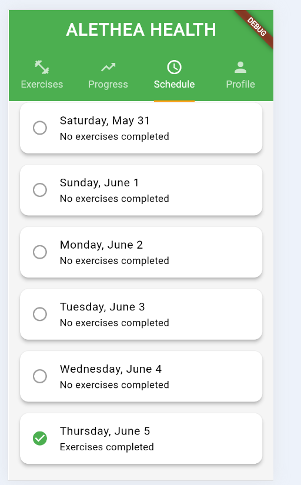

# Aletha_health

At Aletha Health our mission is to improve the physical wellbeing of humans by developing solutions
to alleviate pain and tightness. A mobile exercise app is one of the most convenient and accessible
ways users can use to stay fit and healthy.

## Flutter App Screens
# 1. App Main Screen - list all exercises from api.

# 2. Detail Screen - for exercises with details and descriptions fetched from api.

# 3. Detail Screen - for exercises with timer and alert.

# 4. Progress Tab Screen - for tracking exercises with stats/reports

# 5. Scheduler Screen - for setup exercise goals and completions

# 6. Profile Screen - for user profile login and signout

## credit to AI Tools - Bolt, Lovable
I've created our app using ai tools and hosted to below endpoint. It will support both web and mobile. You can experience the good UI/UX & checkout here

https://rainbow-pithivier-deaa17.netlify.app/

https://alethea-fit-flow.lovable.app/

By
Bhava Tharani
